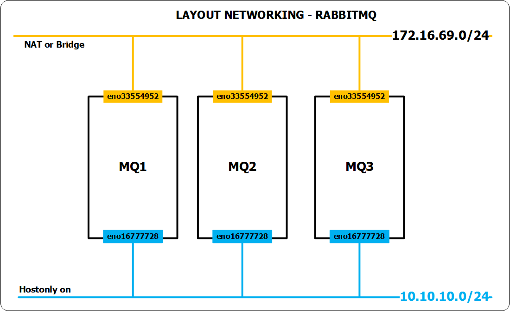
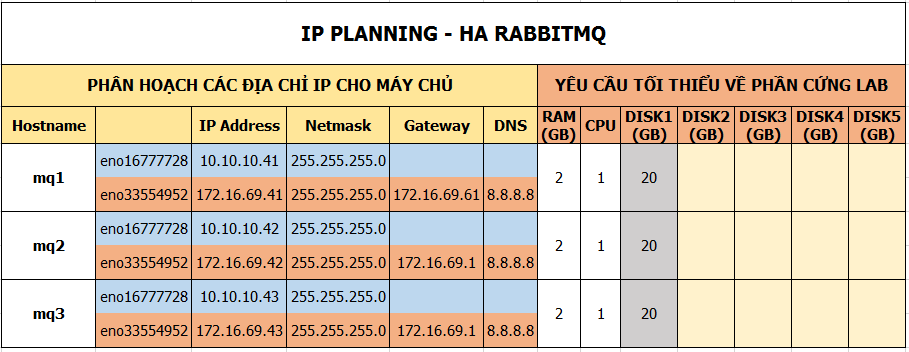

# Cài đặt RabbitMQ

## Môi trường
- CentOS Linux release 7.3.1611 (Core)
- 

## Mô hình
- Mô hình được dựng trên Vmware Workstations


## IP Planning 
- Thiết lập IP như hình dưới



## Thiết lập hostname, network, firewall cho các máy. 
### Cài đặt RabbitMQ trên máy `MQ1`

- Khai bao repos
  ```sh 
  echo "proxy=http://123.30.178.220:3142" >> /etc/yum.conf 
  yum -y update
  ```

- Đặt hostname cho mq1 
  ```sh
  hostnamectl set-hostname mq1
  ```

- Đặt IP cho các NICs 
  ```sh
  echo "Setup IP  eno16777728"
  nmcli c modify eno16777728 ipv4.addresses 10.10.10.41/24
  nmcli c modify eno16777728 ipv4.method manual
  nmcli con mod eno16777728 connection.autoconnect yes

  echo "Setup IP  eno33554952"
  nmcli c modify eno33554952 ipv4.addresses 172.16.69.41/24
  nmcli c modify eno33554952 ipv4.gateway 172.16.69.1
  nmcli c modify eno33554952 ipv4.dns 8.8.8.8
  nmcli c modify eno33554952 ipv4.method manual
  nmcli con mod eno33554952 connection.autoconnect yes

  sudo systemctl disable firewalld
  sudo systemctl stop firewalld
  sudo systemctl disable NetworkManager
  sudo systemctl stop NetworkManager
  sudo systemctl enable network
  sudo systemctl start network

  sed -i 's/SELINUX=enforcing/SELINUX=disabled/g' /etc/sysconfig/selinux
  
  echo "172.16.69.41 mq1" >> /etc/hosts
  echo "172.16.69.42 mq2" >> /etc/hosts
  echo "172.16.69.43 mq3" >> /etc/hosts

  init 6
  ```

### Cài đặt httpd trên máy MQ2

- Khaibáo repos để tăng tốc độ cài đặt
  ```sh
  echo "proxy=http://123.30.178.220:3142" >> /etc/yum.conf 
  yum -y update
  ```

- Đặt hostname cho máy mq2
  ```sh
  hostnamectl set-hostname mq2
  ```
  
- Đặt IP cho các NICs
  ```sh
  echo "Setup IP  eno16777728"
  nmcli c modify eno16777728 ipv4.addresses 10.10.10.42/24
  nmcli c modify eno16777728 ipv4.method manual
  nmcli con mod eno16777728 connection.autoconnect yes

  echo "Setup IP  eno33554952"
  nmcli c modify eno33554952 ipv4.addresses 172.16.69.42/24
  nmcli c modify eno33554952 ipv4.gateway 172.16.69.1
  nmcli c modify eno33554952 ipv4.dns 8.8.8.8
  nmcli c modify eno33554952 ipv4.method manual
  nmcli con mod eno33554952 connection.autoconnect yes

  sudo systemctl disable firewalld
  sudo systemctl stop firewalld
  sudo systemctl disable NetworkManager
  sudo systemctl stop NetworkManager
  sudo systemctl enable network
  sudo systemctl start network

  sed -i 's/SELINUX=enforcing/SELINUX=disabled/g' /etc/sysconfig/selinux
  
  echo "172.16.69.41 mq1" >> /etc/hosts
  echo "172.16.69.42 mq2" >> /etc/hosts
  echo "172.16.69.43 mq3" >> /etc/hosts

  init 6
  ```

### Cài đặt httpd trên máy MQ3

- Khaibáo repos để tăng tốc độ cài đặt
  ```sh
  echo "proxy=http://123.30.178.220:3142" >> /etc/yum.conf 
  yum -y update
  ```

- Đặt hostname cho máy mq3
  ```sh
  hostnamectl set-hostname mq3
  ```
  
- Đặt IP cho các NICs
  ```sh
  echo "Setup IP  eno16777728"
  nmcli c modify eno16777728 ipv4.addresses 10.10.10.43/24
  nmcli c modify eno16777728 ipv4.method manual
  nmcli con mod eno16777728 connection.autoconnect yes

  echo "Setup IP  eno33554952"
  nmcli c modify eno33554952 ipv4.addresses 172.16.69.43/24
  nmcli c modify eno33554952 ipv4.gateway 172.16.69.1
  nmcli c modify eno33554952 ipv4.dns 8.8.8.8
  nmcli c modify eno33554952 ipv4.method manual
  nmcli con mod eno33554952 connection.autoconnect yes

  sudo systemctl disable firewalld
  sudo systemctl stop firewalld
  sudo systemctl disable NetworkManager
  sudo systemctl stop NetworkManager
  sudo systemctl enable network
  sudo systemctl start network

  sed -i 's/SELINUX=enforcing/SELINUX=disabled/g' /etc/sysconfig/selinux
  
  echo "172.16.69.41 mq1" >> /etc/hosts
  echo "172.16.69.42 mq2" >> /etc/hosts
  echo "172.16.69.43 mq3" >> /etc/hosts

  init 6
  ```

## Cài đăt RabbitMQ
### Khai báo repos cho RabbitMQ
- Khai báo repos của OpenStack Newton để có gói rabbitmq phù hợp. Thực hiện trên cả 3 node các bước dưới.
  ```sh
  yum install -y centos-release-openstack-newton
  yum upgrade
  ```

- Nếu cần thì reboot lại các máy sau khi khai báo repos và update để đảm bảo cài đặt thành công.
  ```sh
  init 6
  ```

- Đăng nhập lại từng máy và thực hiện cài đặt RabbitMQ với quyền `root` trên cả 03 node.
  ```sh
  yum install -y rabbitmq-server
  ```

- Kiểm tra version của rabbitmq
  ```sh
  sudo rabbitmqctl status|grep rabbit
  ```
  - Kết quả: 
    ```sh
    [root@mq1 ~]# sudo rabbitmqctl status|grep rabbit
    Status of node rabbit@mq1 ...
     {running_applications,[{rabbit,"RabbitMQ","3.6.5"},
                            {rabbit_common,[],"3.6.5"},
    [root@mq1 ~]#
    ````

  
### Cấu hình RabbitMQ Cluster trên 1 node bất kỳ, trong ví dụ này chọn node `MQ1`
- Kích hoạt và khởi động dịch vụ RabbitMQ
  ```sh
  systemctl enable rabbitmq-server.service
  systemctl start rabbitmq-server.service
  ```
  
- Tạo user và phân quyền cho user `openstack` trong RabbitMQ, mật khẩu là `Welcome123`
  ```sh  
  rabbitmqctl add_user openstack Welcome123

  rabbitmqctl set_permissions openstack ".*" ".*" ".*"
  ```

- Copy file `/var/lib/rabbitmq/.erlang.cookie` từ node1 sang các node còn lại. Thực hiện từng lệnh 1 và nhập mật khẩu của các node còn lại.
  ```sh
  scp /var/lib/rabbitmq/.erlang.cookie root@mq2:/var/lib/rabbitmq/.erlang.cookie

  scp /var/lib/rabbitmq/.erlang.cookie root@mq3:/var/lib/rabbitmq/.erlang.cookie
  ```

- Cấu hình policy HA cho RabbitMQ
  ```sh
  rabbitmqctl set_policy ha-all '^(?!amq\.).*' '{"ha-mode": "all"}'
  ```

- Kiểm tra trạng thái cluster trên `MQ1`
  ```sh
  rabbitmqctl cluster_status
  ```

- Khởi động cluster cho rabbitmq trên MQ1
  ```sh
  rabbitmqctl start_app
  ```

- Kiểm tra lại trạng thái cluster
  ```sh
  rabbitmqctl cluster_status
  ```
  - Kết quả như sau: 
    ```sh
    [root@mq1 ~]# rabbitmqctl cluster_status
    Cluster status of node rabbit@mq1 ...
    [{nodes,[{disc,[rabbit@mq1]}]},
     {running_nodes,[rabbit@mq1]},
     {cluster_name,<<"rabbit@mq1">>},
     {partitions,[]},
     {alarms,[{rabbit@mq1,[]}]}]
    [root@mq1 ~]#
    ```

### Thực hiện các bước trên 2 node còn lại.
- Phân quyền file `/var/lib/rabbitmq/.erlang.cookie` vừa copy ở `node MQ1` trong bước trên.
- Thực hiện các bước này trên cả `MQ2` và `MQ3` 

  ```sh
  chown rabbitmq:rabbitmq /var/lib/rabbitmq/.erlang.cookie
  chmod 400 /var/lib/rabbitmq/.erlang.cookie
  ````
  
- Khởi động rabbitmq trên cả 2 node MQ2 và MQ3 
  ```sh
  systemctl enable rabbitmq-server.service
  systemctl start rabbitmq-server.service
  ```
  
- Đứng trên MQ2 thực hiện join vào cluster đã tạo ở trên.
  ```sh
  rabbitmqctl stop_app
  rabbitmqctl join_cluster rabbit@mq1
  ```

  
- Đứng trên MQ3 thực hiện join vào cluster đã tạo ở trên.
  ```sh
  rabbitmqctl stop_app
  rabbitmqctl join_cluster rabbit@mq1
  ```

- Đứng trên từng node thực hiện lệnh kiểm tra trạng thái cluster
  ```sh
  rabbitmqctl cluster_status
  ```
  - Kết quả như bên dưới
    ```sh
    [root@mq1 ~]# rabbitmqctl cluster_status
    Cluster status of node rabbit@mq1 ...
    [{nodes,[{disc,[rabbit@mq1,rabbit@mq2,rabbit@mq3]}]},
     {running_nodes,[rabbit@mq3,rabbit@mq2,rabbit@mq1]},
     {cluster_name,<<"rabbit@mq1">>},
     {partitions,[]},
     {alarms,[{rabbit@mq3,[]},{rabbit@mq2,[]},{rabbit@mq1,[]}]}]
    [root@mq1 ~]#
    ```


- 


