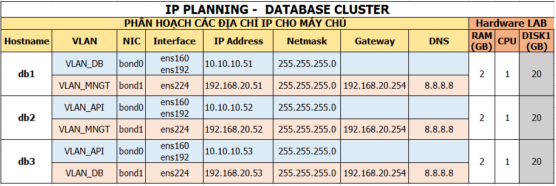

# Hướng dẫn cài đặt MariaDB - Galera

## Mô hình
```sh
Ảnh mô hình LAB
```

## IP Planning


### Khai báo IP, hostname
- Thực hiện các bước sau trên tất cả 03 server 
- Khai báo IP 
```sh
Thực hiện theo script sau
```
Thực hiện theo script sau
  ```sh 
  echo "192.168.20.51 db1" >> /etc/hosts
  echo "192.168.20.52 db2" >> /etc/hosts
  echo "192.168.20.53 db3" >> /etc/hosts
  ```
- Khai báo file `/etc/hosts`


- Khai báo repos
  ```sh
  yum -y install centos-release-openstack-newton
  yum -y upgrade
  
  echo '[mariadb]
  name = MariaDB
  baseurl = http://yum.mariadb.org/10.1/centos7-amd64
  gpgkey=https://yum.mariadb.org/RPM-GPG-KEY-MariaDB
  gpgcheck=1' >> /etc/yum.repos.d/MariaDB.repo
  ```

### Cài đặt các gói của MariaDB, Galera
- Cài đặt các gói sau trên tất cả 03 server 
  ```sh
  yum -y install mariadb-server rsync xinetd crudini
  ```

- Sao lưu file cấu hình của mariadb
  ```sh
  cp /etc/my.cnf.d/mariadb-server.cnf  /etc/my.cnf.d/mariadb-server.cnf.orig
  ```
#### Sửa file cấu hình trên DB1
- Thực hiện các lệnh dưới trên DB1 

```sh
crudini --set /etc/my.cnf.d/mariadb-server.cnf galera wsrep_on ON
crudini --set /etc/my.cnf.d/mariadb-server.cnf galera wsrep_provider /usr/lib64/galera/libgalera_smm.so
crudini --set /etc/my.cnf.d/mariadb-server.cnf galera wsrep_cluster_address "gcomm://192.168.20.51,192.168.20.52,192.168.20.53" 
crudini --set /etc/my.cnf.d/mariadb-server.cnf galera binlog_format row
crudini --set /etc/my.cnf.d/mariadb-server.cnf galera default_storage_engine InnoDB
crudini --set /etc/my.cnf.d/mariadb-server.cnf galera innodb_autoinc_lock_mode 2
crudini --set /etc/my.cnf.d/mariadb-server.cnf galera wsrep_cluster_name "linoxide_cluster"
crudini --set /etc/my.cnf.d/mariadb-server.cnf galera bind-address 0.0.0.0
crudini --set /etc/my.cnf.d/mariadb-server.cnf galera wsrep_node_address "192.168.20.51"
crudini --set /etc/my.cnf.d/mariadb-server.cnf galera wsrep_node_name "db1"
crudini --set /etc/my.cnf.d/mariadb-server.cnf galera wsrep_sst_method rsync
```

- Thực hiện các lệnh dưới trên DB2

```sh
crudini --set /etc/my.cnf.d/mariadb-server.cnf galera wsrep_on ON
crudini --set /etc/my.cnf.d/mariadb-server.cnf galera wsrep_provider /usr/lib64/galera/libgalera_smm.so
crudini --set /etc/my.cnf.d/mariadb-server.cnf galera wsrep_cluster_address "gcomm://192.168.20.51,192.168.20.52,192.168.20.53" 
crudini --set /etc/my.cnf.d/mariadb-server.cnf galera binlog_format row
crudini --set /etc/my.cnf.d/mariadb-server.cnf galera default_storage_engine InnoDB
crudini --set /etc/my.cnf.d/mariadb-server.cnf galera innodb_autoinc_lock_mode 2
crudini --set /etc/my.cnf.d/mariadb-server.cnf galera wsrep_cluster_name "linoxide_cluster"
crudini --set /etc/my.cnf.d/mariadb-server.cnf galera bind-address 0.0.0.0
crudini --set /etc/my.cnf.d/mariadb-server.cnf galera wsrep_node_address "192.168.20.52"
crudini --set /etc/my.cnf.d/mariadb-server.cnf galera wsrep_node_name "db2"
crudini --set /etc/my.cnf.d/mariadb-server.cnf galera wsrep_sst_method rsync
```

- Thực hiện các lệnh dưới trên DB3
```sh
crudini --set /etc/my.cnf.d/mariadb-server.cnf galera wsrep_on ON
crudini --set /etc/my.cnf.d/mariadb-server.cnf galera wsrep_provider /usr/lib64/galera/libgalera_smm.so
crudini --set /etc/my.cnf.d/mariadb-server.cnf galera wsrep_cluster_address "gcomm://192.168.20.51,192.168.20.52,192.168.20.53" 
crudini --set /etc/my.cnf.d/mariadb-server.cnf galera binlog_format row
crudini --set /etc/my.cnf.d/mariadb-server.cnf galera default_storage_engine InnoDB
crudini --set /etc/my.cnf.d/mariadb-server.cnf galera innodb_autoinc_lock_mode 2
crudini --set /etc/my.cnf.d/mariadb-server.cnf galera wsrep_cluster_name "linoxide_cluster"
crudini --set /etc/my.cnf.d/mariadb-server.cnf galera bind-address 0.0.0.0
crudini --set /etc/my.cnf.d/mariadb-server.cnf galera wsrep_node_address "192.168.20.53"
crudini --set /etc/my.cnf.d/mariadb-server.cnf galera wsrep_node_name "db2"
crudini --set /etc/my.cnf.d/mariadb-server.cnf galera wsrep_sst_method rsync
```
