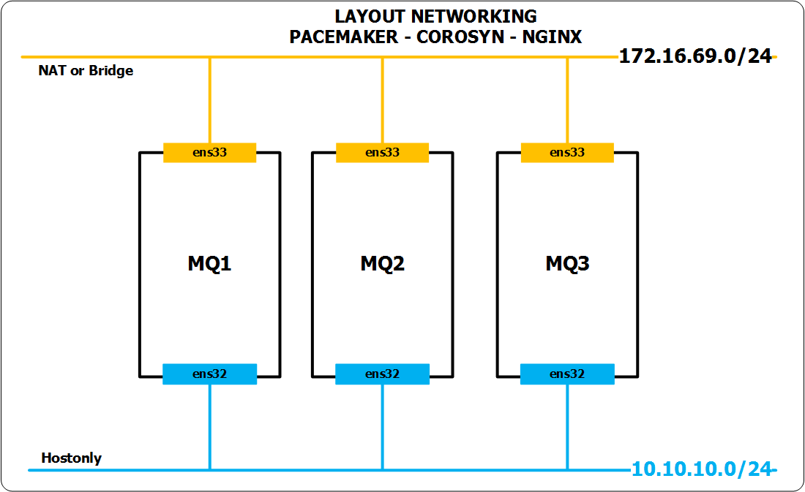

# Cài đặt httpd, pacemaker, corosync

## Môi trường
- OS: CentOS7.3 1611 64 bit
- Nginx: nginx/1.10.2
- Pacemaker: pacemaker-1.1.15-11.el7_3.4.x86_64
- Corosync: corosync-2.4.0-4.el7.x86_64

## Mô hình


## IP Planning 


# Cài đặt NIGNX
### Cài đặt NGINX trên LoadBalancer1

- Khaibáo repos để tăng tốc độ cài đặt
  ```
  echo "proxy=http://123.30.178.220:3142" >> /etc/yum.conf 
  yum -y update
  ```

- Đặt hostname cho LoadBalancer1
  ```sh
  hostnamectl set-hostname lb1
  
  echo "172.16.69.51 lb1" >> /etc/hosts
  echo "172.16.69.52 lb2" >> /etc/hosts
  echo "172.16.69.53 lb3" >> /etc/hosts
  ```

- Đặt địa chỉ IP cho các NICs
  ```sh
  echo "Setup IP  ens32"
  nmcli c modify ens32 ipv4.addresses 10.10.10.51/24
  nmcli c modify ens32 ipv4.method manual
  nmcli con mod ens32 connection.autoconnect yes

  echo "Setup IP  ens33"
  nmcli c modify ens33 ipv4.addresses 172.16.69.51/24
  nmcli c modify ens33 ipv4.gateway 172.16.69.1
  nmcli c modify ens33 ipv4.dns 8.8.8.8
  nmcli c modify ens33 ipv4.method manual
  nmcli con mod ens33 connection.autoconnect yes

  sudo systemctl disable firewalld
  sudo systemctl stop firewalld
  sudo systemctl disable NetworkManager
  sudo systemctl stop NetworkManager
  sudo systemctl enable network
  sudo systemctl start network

  sed -i 's/SELINUX=enforcing/SELINUX=disabled/g' /etc/sysconfig/selinux
  sed -i 's/SELINUX=enforcing/SELINUX=disabled/g' /etc/sysconfig/selinux

  init 6
  ```

- Đăng nhập lại vào máy LoadBalancer1 với địa chỉ ở trên và cài nginx
  ```sh
  yum install -y wget 
  yum install -y epel-release
  
  yum --enablerepo=epel -y install nginx
  ```

- Khởi động nginx
  ```sh
  systemctl start nginx 
  systemctl enable nginx
  ```

- Kiểm tra trạng thái của NGINX
  ```sh
  systemctl status nginx 
  ```

- Kiểm tra phiên bản của nginx bằng lệnh `nginx -v`
  ```sh
  [root@lb1 ~]# nginx -v
  nginx version: nginx/1.10.2
  ```
  
- Tạo 1 trang html trên LoadBalancer1 để test 
  ```sh
  cat << EOF > /usr/share/nginx/html/index.html
  <html>
  <body>
  <div style="width: 100%; font-size: 40px; font-weight: bold; text-align: center;">
  nginx-`hostname`
  </div>
  </body>
  </html>
  EOF
  ```
- Khởi động lại nginx
  ```sh
  systemctl restart nginx 
  ```
  
- Truy cập vào IP của LoadBalancer1, sẽ thấy hostname của LoadBalancer1

### Cài đặt NGINX trên LoadBalancer2 
- Khaibáo repos để tăng tốc độ cài đặt
  ```sh
  echo "proxy=http://123.30.178.220:3142" >> /etc/yum.conf 
  yum -y update
  ```
- Đặt hostname cho LoadBalancer2
  ```sh
  hostnamectl set-hostname lb2
  
  echo "172.16.69.51 lb1" >> /etc/hosts
  echo "172.16.69.52 lb2" >> /etc/hosts
  echo "172.16.69.53 lb3" >> /etc/hosts
  ```
- Đặt IP cho các NICs
  ```sh
  echo "Setup IP  ens32"
  nmcli c modify ens32 ipv4.addresses 10.10.10.52/24
  nmcli c modify ens32 ipv4.method manual
  nmcli con mod ens32 connection.autoconnect yes

  echo "Setup IP  ens33"
  nmcli c modify ens33 ipv4.addresses 172.16.69.52/24
  nmcli c modify ens33 ipv4.gateway 172.16.69.1
  nmcli c modify ens33 ipv4.dns 8.8.8.8
  nmcli c modify ens33 ipv4.method manual
  nmcli con mod ens33 connection.autoconnect yes

  sudo systemctl disable firewalld
  sudo systemctl stop firewalld
  sudo systemctl disable NetworkManager
  sudo systemctl stop NetworkManager
  sudo systemctl enable network
  sudo systemctl start network

  sed -i 's/SELINUX=enforcing/SELINUX=disabled/g' /etc/sysconfig/selinux
  sed -i 's/SELINUX=enforcing/SELINUX=disabled/g' /etc/selinux/config

  init 6
  ```

- Đăng nhập lại vào máy LoadBalancer2 với địa chỉ ở trên và cài nginx trên LoadBalancer2
  ```sh
  yum install -y wget 
  yum install -y epel-release

  yum --enablerepo=epel -y install nginx
  ```
  
- Khởi động nginx
  ```sh
  systemctl start nginx 
  systemctl enable nginx
  ```

- Kiểm tra trạng thái của NGINX
  ```sh
  systemctl status nginx 
  ```

- Kiểm tra phiên bản của nginx bằng lệnh `nginx -v`
  ```sh
  [root@lb2 ~]# nginx -v
  nginx version: nginx/1.10.2
  ```
  
- Tạo 1 trang html trên LoadBalancer2 để test 
  ```sh
  cat << EOF > /usr/share/nginx/html/index.html
  <html>
  <body>
  <div style="width: 100%; font-size: 40px; font-weight: bold; text-align: center;">
  NGINX-`hostname`
  </div>
  </body>
  </html>
  EOF
  ```
  
- Khởi động lại nginx
  ```sh
  systemctl restart nginx 
  ```
  
- Truy cập vào IP của LoadBalancer2, sẽ thấy hostname của LoadBalancer2

### Cài đặt NGINX trên LoadBalancer3 
- Khaibáo repos để tăng tốc độ cài đặt
  ```sh
  echo "proxy=http://123.30.178.220:3142" >> /etc/yum.conf 
  yum -y update
  ```
- Đặt hostname cho LoadBalancer3
  ```sh
  hostnamectl set-hostname lb3
  
  echo "172.16.69.51 lb1" >> /etc/hosts
  echo "172.16.69.52 lb2" >> /etc/hosts
  echo "172.16.69.53 lb3" >> /etc/hosts
  ```
- Đặt IP cho các NICs
  ```sh
  echo "Setup IP  ens32"
  nmcli c modify ens32 ipv4.addresses 10.10.10.53/24
  nmcli c modify ens32 ipv4.method manual
  nmcli con mod ens32 connection.autoconnect yes

  echo "Setup IP  ens33"
  nmcli c modify ens33 ipv4.addresses 172.16.69.53/24
  nmcli c modify ens33 ipv4.gateway 172.16.69.1
  nmcli c modify ens33 ipv4.dns 8.8.8.8
  nmcli c modify ens33 ipv4.method manual
  nmcli con mod ens33 connection.autoconnect yes

  sudo systemctl disable firewalld
  sudo systemctl stop firewalld
  sudo systemctl disable NetworkManager
  sudo systemctl stop NetworkManager
  sudo systemctl enable network
  sudo systemctl start network

  sed -i 's/SELINUX=enforcing/SELINUX=disabled/g' /etc/sysconfig/selinux
  sed -i 's/SELINUX=enforcing/SELINUX=disabled/g' /etc/selinux/config

  init 6
  ```

- Đăng nhập lại vào máy LoadBalancer3 với địa chỉ ở trên và cài nginx trên LoadBalancer3
  ```sh
  yum install -y wget 
  yum install -y epel-release

  yum --enablerepo=epel -y install nginx
  ```
  
- Khởi động nginx
  ```sh
  systemctl start nginx 
  systemctl enable nginx
  ```

- Kiểm tra trạng thái của NGINX
  ```sh
  systemctl status nginx 
  ```

- Kiểm tra phiên bản của nginx bằng lệnh `nginx -v`
  ```sh
  [root@lb2 ~]# nginx -v
  nginx version: nginx/1.10.2
  ```
  
- Tạo 1 trang html trên LoadBalancer3 để test 
  ```sh
  cat << EOF > /usr/share/nginx/html/index.html
  <html>
  <body>
  <div style="width: 100%; font-size: 40px; font-weight: bold; text-align: center;">
  NGINX-`hostname`
  </div>
  </body>
  </html>
  EOF
  ```
  
- Khởi động lại nginx
  ```sh
  systemctl restart nginx 
  ```
  
- Truy cập vào IP của LoadBalancer3, sẽ thấy hostname của LoadBalancer3

## Cài đặt pacemaker và corosync để tạo cluster cho nginx 
- Packer dùng để quản lý các tài nguyên (web server - nginx, database, IP VIP)
- Corosync dùng để làm `messenger` theo dõi tình trạng của các tài nguyên ở trên. 

### Cài đặt pacemaker trên máy chủ LoadBalancer1  và trên LoadBalancer2 
- Lưu ý:
  - Mặc dù có 03 node nhưng bước này chỉ thực hiện trên 2 máy chủ LoadBalancer (LoadBalancer1 và LoadBalancer2). Mảy chủ LoadBalancer3 sẽ để mở rộng sau.

- Cài đặt `pacemaker` trên các máy chủ `LoadBalancer1` và `LoadBalancer2`. Nếu muốn triển khai cả 3 máy thì thực hiện luôn trên `LoadBalancer3`
  ```sh
  yum -y install pacemaker pcs
  ```
  - Sử dụng lệnh dưới để kiểm tra xem có gói `pacemaker` và `corosync` hay chưa `rpm -qa | egrep "pacemaker|corosync"`. Dưới là các phiên bản của `pacemaker` và `corosync`
    ```sh
    [root@lb1 ~]# rpm -qa | egrep "pacemaker|corosync"
    corosynclib-2.4.0-4.el7.x86_64
    pacemaker-cluster-libs-1.1.15-11.el7_3.4.x86_64
    pacemaker-1.1.15-11.el7_3.4.x86_64
    corosync-2.4.0-4.el7.x86_64
    pacemaker-cli-1.1.15-11.el7_3.4.x86_64
    pacemaker-libs-1.1.15-11.el7_3.4.x86_64
    ```
  - Từ CentOS7 trở đi, khi cài `pacemaker` thì `corosync` sẽ được cài cùng. Ngoài ra, khi cài pacemaker thì user `hacluster` sẽ được tạo ra và gán vào group `haclient`. Ở bước dưới cần đặt mật khẩu cho user `hacluster` để xác thực các node trong cluster với nhau. 
  
- Khởi động và cho phép pacemaker bật khi máy chủ reboot
  ```sh
  systemctl start pcsd 
  systemctl enable pcsd
  ```

- Kiểm tra lại trạng thái của `pacemaker` bằng lệnh `systemctl startus pcsd`, kết quả như sau:
  ```sh
  [root@lb1 ~]# systemctl status pcsd
  ● pcsd.service - PCS GUI and remote configuration interface
     Loaded: loaded (/usr/lib/systemd/system/pcsd.service; enabled; vendor preset: disabled)
     Active: active (running) since Thu 2017-05-04 22:33:38 +07; 13s ago
   Main PID: 2578 (pcsd)
     CGroup: /system.slice/pcsd.service
             └─2578 /usr/bin/ruby /usr/lib/pcsd/pcsd > /dev/null &

  May 04 22:33:37 lb1 systemd[1]: Starting PCS GUI and remote configuration interface...
  May 04 22:33:38 lb1 systemd[1]: Started PCS GUI and remote configuration interface.
  ```
  - Lưu ý 2 dòng cuối của lệnh trên. 
  
- Đặt mật khẩu cho user `hacluster` của cluster, nhập mật khẩu mà bạn muốn sử dụng.
  ```sh
  passwd hacluster
  ```
  - Lưu ý: đặt mật khẩu giống nhau trên cả 2 node LoadBalancer1 và LoadBalancer2.
- Trong bước kiểm tra trạng thái của `pacemaker` xem đã ok hay chưa, ta sẽ thấy thông báo về `PCS GUI` đã được cài đặt, đây là công cụ WEB để quản lý cluster. Đăng nhập bằng trình duyệt với địa chỉ của máy cài đặt pacemaker, ví dụ ở đây là `https://172.16.69.51:2224`, hãy nhập user là `hacluster` và mật khẩu bạn vừa nhập ở trên. 
- GUI này có từ CentOS7.x trở đi. 

- Chuyển sang máy chủ `LoadBalancer2` và thực hiện các bước cài như trên. Sau khi hoàn thành sẽ xuống bước dưới để thực hiện cấu hình cluster trên một trong các máy chủ trong cụm Cluster. Trong ví dụ này tôi sẽ thực hiện trên máy chủ `LoadBalancer1`
- Khi đăng nhập bằng user `hacluster` vào địa chỉ `https://172.16.69.51:2224` ta sẽ có giao diện sau: http://prntscr.com/f42yvc
- Ta có thể sử dụng giao diện này để quản lý, xem thông tin của cluster. Việc dùng giao diện này để quản lý Cluster sẽ được kiểm chứng sau. 
- Có thể sử dụng các lệnh sau để kiểm tra phiên bản của pacemaker, corosync
  ```sh
  [root@lb1 ~]# corosync -v
  Corosync Cluster Engine, version '2.4.0'
  Copyright (c) 2006-2009 Red Hat, Inc.
  ```
  hoặc

  ```sh
  [root@lb1 ~]# pacemakerd --version
  Pacemaker 1.1.15-11.el7_3.4
  Written by Andrew Beekhof
  ```

### Tạo cluster 
- Đứng trên 1 trong 2 máy chủ để thực hiện các bước dưới. Lưu ý: chỉ đứng trên 1 trong các máy chủ thực hiện bước này. Ví dụ này tôi sẽ đứng trên máy chủ `LoadBalancer1` để thực hiện việc tạo cluster. 
- Thực hiện lệnh dưới để thiết lập xác thực giữa `LoadBalancer1` và `LoadBalancer2`, trong hướng dẫn này tôi đứng trên LoadBalancer1. Thực hiện lệnh dưới sẽ yêu cầu bạn nhập user mà cụm cluster sẽ sử dụng, trong hướng dẫn này là user `hacluster` đã được tạo trong quá trình cài đặt `pacemaker` và `corosync`. 

  ```sh
  pcs cluster auth lb1 lb2
  ```
  - Kết quả như sau:
      ```
      [root@lb1 ~]# pcs cluster auth lb1 lb2
      Username: hacluster
      Password:
      lb1: Authorized
      lb2: Authorized
      ```
- Cấu hình cluster 
  ```sh
  pcs cluster setup --name ha_cluster lb1 lb2
  ```
- Trong lệnh trên:
  - `ha_cluster` là tên của cluster mà bạn sẽ tạo, mục này có thể nhập tùy ý.
  - `lb1 lb2` là hostname các máy chủ trong cụm cluster. Muốn sử dụng tên này thì bạn phải chắc chắn đã khai báo trong file `/etc/hosts`

  - Kết quả của lệnh trên như sau
    ```sh
    [root@lb1 ~]# pcs cluster setup --name ha_cluster lb1 lb2
    Destroying cluster on nodes: lb1, lb2...
    lb1: Stopping Cluster (pacemaker)...
    lb2: Stopping Cluster (pacemaker)...
    lb1: Successfully destroyed cluster
    lb2: Successfully destroyed cluster

    Sending cluster config files to the nodes...
    lb1: Succeeded
    lb2: Succeeded

    Synchronizing pcsd certificates on nodes lb1, lb2...
    lb1: Success
    lb2: Success

    Restarting pcsd on the nodes in order to reload the certificates...
    lb1: Success
    lb2: Success
    [root@lb1 ~]#
    ```
    
- Sau bước này, trên các máy chủ trong cụm cluster sẽ sinh ra file `/etc/corosync/corosync.conf` có nội dung giống nhau, trong ví dụ này nội dung như sau (Trước kia ở CentOS6.x ta phải cấu hình bằng tay file này):  
  ```sh
  [root@lb2 corosync]# cat corosync.conf
  totem {
      version: 2
      secauth: off
      cluster_name: ha_cluster
      transport: udpu
  }

  nodelist {
      node {
          ring0_addr: lb1
          nodeid: 1
      }

      node {
          ring0_addr: lb2
          nodeid: 2
      }
  }

  quorum {
      provider: corosync_votequorum
      two_node: 1
  }

  logging {
      to_logfile: yes
      logfile: /var/log/cluster/corosync.log
      to_syslog: yes
  }
  ``` 
    
- Khởi động cluster vừa tạo ở trên, với tùy chọn `--all` chỉ ra rằng cluster sẽ được start trên tất cả các máy chủ đã xác thực ở bước trên. Lưu ý: Chỉ đứng trên 1 node tại 1 thời điểm thực hiện bước này.
  ```sh
  pcs cluster start --all 
  ```
  - Kết quả
  ```sh
  [root@lb1 ~]# pcs cluster start --all
  lb2: Starting Cluster...
  lb1: Starting Cluster...
  ```
  - Với bước này thì `corosync` cũng được khởi động cùng OS và khởi động trên tất cả các máy chủ trong cụm cluster, có thể kiểm tra bằng lệnh `systemctl status corosync` và `systemctl status pacemaker`


- Kích hoạt cluster để cho phép khởi động cùng OS. Chỉ đứng trên 1 node tại 1 thời điểm thực hiện bước này 
  ```sh
  pcs cluster enable --all 
  ```
  - Kết quả: 
  ```sh
  [root@lb1 ~]# pcs cluster enable --all
  lb1: Cluster Enabled
  lb2: Cluster Enabled
  ```

- Kiểm tra trạng thái của cluster (`pacemaker`). Có thể đứng trên 1 trong node bất kỳ của cụm cluster để kiểm tra
  ```sh
  pcs status cluster 
  ```
  - Kết quả:
  ```sh
  [root@lb1 ~]#   pcs status cluster
  Cluster Status:
   Stack: corosync
   Current DC: lb2 (version 1.1.15-11.el7_3.4-e174ec8) - partition with quorum
   Last updated: Wed Apr 26 07:53:32 2017         Last change: Wed Apr 26 00:53:05 2017 by hacluster via crmd on lb2
   2 nodes and 0 resources configured

  PCSD Status:
    lb1: Online
    lb2: Online
  ```
  
- Kiểm tra `corosync`, Có thể đứng trên 1 trong node bất kỳ của cụm cluster để kiểm tra
  ```sh
  pcs status corosync
  ```
  
  - Kết quả:
    ```sh
    [root@lb1 ~]# pcs status corosync

    Membership information
    ----------------------
        Nodeid      Votes Name
             1          1 lb1 (local)
             2          1 lb2
    ```

- Lưu ý: tới đây mới chỉ đảm bảo cụm cluster đã sẵn sàng để hoạt động, cần add thêm các `resources agent` để pacemaker quản lý. Thực hiện ở phần dưới.

## Cấu hình để thêm các resources vào Cluster
- Trong hướng dẫn này sẽ thêm các `resources agent` của NGINX và IP VIP.
- Chỉ cần đứng trên 1 node bất kỳ trong cụm cluster để thưc hiện, trong ví dụ này thực hiện trên node `LoadBalancer1`

### Cấu hình cơ bản cho NGINX
- Disable cơ chế `STONITH`
  ```sh
  pcs property set stonith-enabled=false
  ```

- Thiết lập policy cho cơ chế `quorum` (bỏ qua bước này nếu như bạn có chỉ có 2 node)
  ```sh
  pcs property set no-quorum-policy=ignore
  ```

- Disable auto failbask
  ```sh
  pcs property set default-resource-stickiness="INFINITY"
  ```

- Kiểm tra lại các thiết lập ở trên
  ```sh
  pcs property list 
  ```
  - Kết quả như bên dưới
    ```sh
    [root@lb1 ~]# pcs property list
    Cluster Properties:
     cluster-infrastructure: corosync
     cluster-name: ha_cluster
     dc-version: 1.1.15-11.el7_3.4-e174ec8
     default-resource-stickiness: INFINITY
     have-watchdog: false
     no-quorum-policy: ignore
     stonith-enabled: false
    ```

## Thêm resource `NGINX` để pacemaker quản lý.
- Chú ý: 
  - Resource chính là các ứng dụng được cấu hình cluster.
  - Tùy vào tài ngyên mà bạn muốn pacemaker quản lý thì sẽ được add thêm vào trong Cluster.
  - Khi add resource vào cluster thì việc   start, stop, restart` resource này sẽ do pacemaker quản lý. 
  - Corosync có nhiệm vụ làm messenger để báo cho các node biết tính hình các resource đang như thế nào.

### Thêm resource Virtual IP (VIP) để pacemaker quản lý.

- Thiết lập Virtual IP (VIP) cho Cluster. Lựa chọn 1 IP mà bạn muốn làm VIP, IP này chưa được sử dụng trong hệ thống nhé.
- Trong bài lab này, tôi lựa chọn là `172.16.69.20`. 
- Tên của resource là `Virtual_IP`
  ```sh
  pcs resource create Virtual_IP ocf:heartbeat:IPaddr2 ip=172.16.69.20 cidr_netmask=32 op monitor interval=30s
  ````

- Kiểm tra trạng thái của các resource hiện tại. 
  ```sh
  pcs status resources 
  ```
 
### Thêm resource `NGINX` để pacemaker quản lý.

- Thực hiện add resource của NGINX, đặt tên là `Web_Cluster`
- Yêu cầu cần có là nginx đã được cấu hình với mục tiêu là Load Blancing. 
- Trong mô hình này tham khảo file cấu hình của NGINX ở đây, file này đã cấu hình NGINX làm chức năng Load Blancing cho Apache: [File cấu hình nginx](https://gist.githubusercontent.com/congto/ee3e0c28f15aa690ed40c139a960ca3a/raw/08fea694ad17dedc614414eb18dc189656582eed/File_config_nginx_LB_apache_2node) . Cần phải đảm bảo đã khai báo cấu hình này trên 2 node nginx.

  ```sh
  pcs resource create Web_Cluster \
  ocf:heartbeat:nginx \
  configfile=/etc/nginx/nginx.conf \
  status10url \
  op monitor interval=5s 
  ```
- Kiểm tra trạng thái của các resource hiện tại. 
  ```sh
  pcs status resources 
  ```
  - Kết quả như bên dưới
  ```
  [root@lb1 ~]# pcs status resources
   Virtual_IP     (ocf::heartbeat:IPaddr2):       Started lb1
   Web_Cluster    (ocf::heartbeat:nginx): Started lb2
  ```
  
- Trong kết quả trên ta thấy 2 resource đang hoạt động trên 2 node khác nhau, cần thực hiện các bước dưới để cấu hình cluster được hoàn tất. 

  
### Cấu hình điều kiện ràng buộc cho các resource
- Cấu hình để thiết lập resource `Virtual_IP` và `Web_Cluster` hoạt động trên cùng 1 máy trong cụm cluster
  ```sh 
  pcs constraint colocation add Web_Cluster with Virtual_IP INFINITY
  ```

- Thiết lập chế độ khởi động của các resource
  ```sh
  pcs constraint order Virtual_IP then Web_Cluster
  ````

- Kiểm tra lại các thiết lập trên
  ```sh
  pcs constraint
  ```
  - Kết quả của lệnh trên như sau
    ```sh
    [root@lb1 ~]# pcs constraint
    Location Constraints:
    Ordering Constraints:
      start Virtual_IP then start Web_Cluster (kind:Mandatory)
    Colocation Constraints:
      Web_Cluster with Virtual_IP (score:INFINITY)
    Ticket Constraints:
    ```
  
- Kiểm tra lại trạng thái của các resource, ta sẽ thấy chúng được started trên cùng 1 node.
  ```sh
  [root@lb1 nginx]# pcs status resources
   Virtual_IP     (ocf::heartbeat:IPaddr2):       Started lb1
   Web_Cluster    (ocf::heartbeat:nginx): Started lb1
  [root@lb1 nginx]#
  ```

### Kiểm tra hoạt động của Cluster 

- Sử dụng lệnh `crm_mon -1` để kiểm tra hoạt động của cluster 
  ```sh
  crm_mon -1
  ```
  - Kết quả của lệnh `crm_mon -1`
    ```sh
    [root@lb1 ~]# crm_mon -1
    Stack: corosync
    Current DC: lb2 (version 1.1.15-11.el7_3.4-e174ec8) - partition with quorum
    Last updated: Wed Apr 26 17:32:19 2017          Last change: Wed Apr 26 17:00:10 2017 by root via cibadmin on lb1

    2 nodes and 2 resources configured

    Online: [ lb1 lb2 ]

    Active resources:

     Virtual_IP     (ocf::heartbeat:IPaddr2):       Started lb2
     Web_Cluster    (ocf::heartbeat:nginx): Started lb2
    ```
    - Trong kết quả trên, ta có thể quan sát các resource đang được quản lý bởi pacemaker, các resource đang nằm trên node nào. 
    


# Tham khảo:
- https://www.server-world.info/en/note?os=CentOS_7&p=nginx
- http://blog.air-foron.com/linux/centos-7/post-1433/
- https://www.server-world.info/en/note?os=CentOS_7&p=pacemaker&f=1
- http://www.unixarena.com/2015/12/rhel-7-configuring-pacemaker-corosync-redhat-cluster-part-4.html


