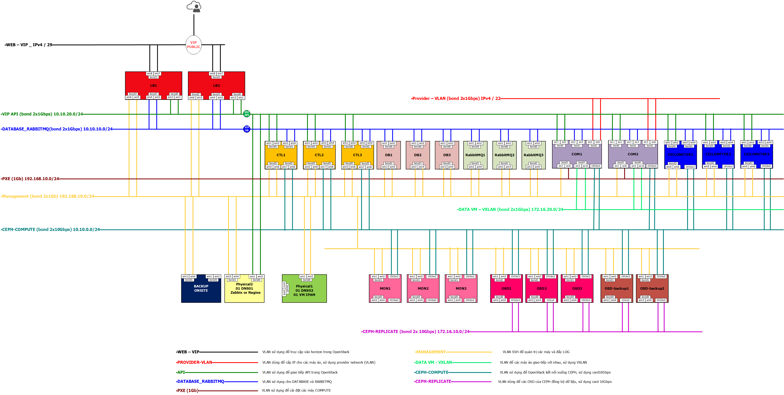
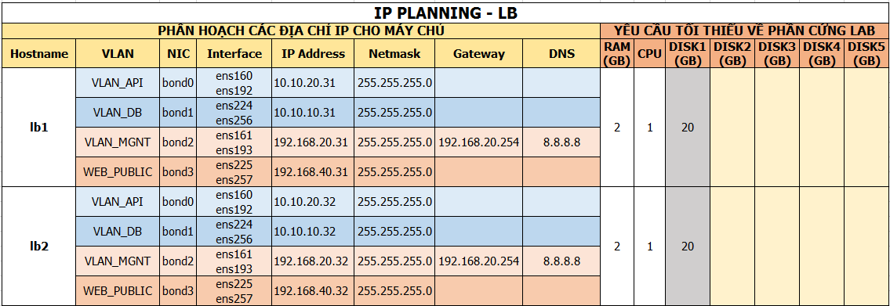
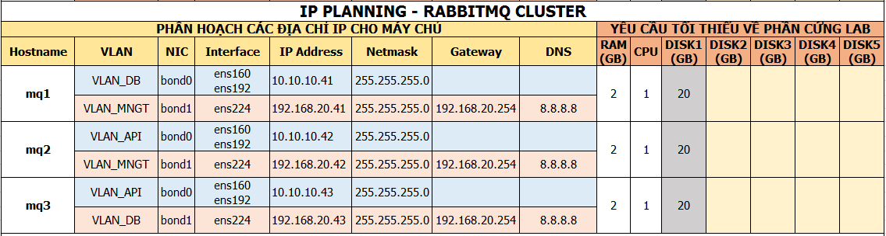
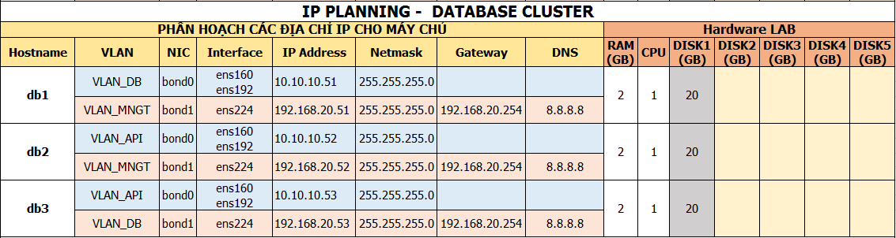
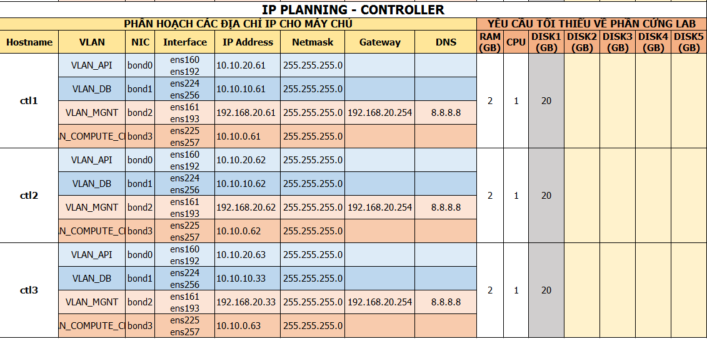
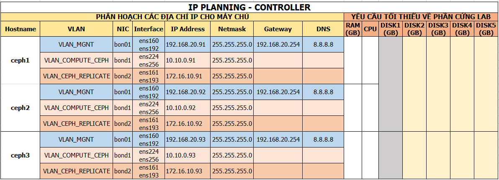
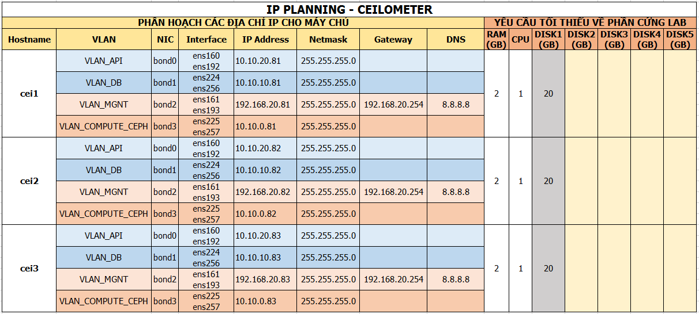

# Hướng dẫn thực hiện
# MỤC LỤC 

1. Cài đặt trên các máy chủ LB
2. Cài đặt trên các máy chủ RABBITMQ
3. Cài đặt trên các máy chủ DATABASE
4. Cài đặt trên các máy chủ CONTROLLER
5. Cài đặt trên các máy chủ CEILOMETER


### Môi trường lab
- OS: Centos Minimal 7.3 - 64 bit

### Mô hình


### IP Planning














## 1. Cài đặt trên các node LoadBalancer (Pacemaker, Corosync, Nginx)

### 1.1. Thực hiện script cấu hình bonding cho các node LB
- Đứng trên máy chủ LB1, tải và thực hiện script để cấu hình bonding
  ```sh
  curl -O https://raw.githubusercontent.com/congto/openstack-HA/master/scripts/lb-bonding.sh
  bash lb-bonding.sh lb1 10.10.20.31 10.10.10.31 192.168.20.31 192.168.40.31
  ```

- Đứng trên máy chủ LB2, tải và thực hiện script để cấu hình bonding
  ```sh
  curl -O https://raw.githubusercontent.com/congto/openstack-HA/master/scripts/lb-bonding.sh
  bash lb-bonding.sh lb2 10.10.20.32 10.10.10.32 192.168.20.32 192.168.40.32
  ```

### 1.2. Thực hiện script cài đặt pacemaker, corosync, cấu hình cluster

- Đứng trên máy chủ LB1, thực hiện script sau. Kết thúc script thì cả 2 node sẽ được cài đặt pacemaker, corosync và cấu hình cluster. 
  ```sh
  curl -O https://raw.githubusercontent.com/congto/openstack-HA/master/scripts/lb-install.sh
  bash lb-install.sh
  ```
  
- Sau khi cấu hình cluster xong, thực hiện add resources cho pacemaker
  ```sh
  curl -O https://raw.githubusercontent.com/congto/openstack-HA/master/scripts/lb-add-resources.sh
  bash lb-add-resources.sh
  ```

## 2. Cài đặt RABBITMQ 
### 2.1. Thực hiện script cấu hình bonding cho các RABBITMQ
- Đăng nhập vào máy RABBITMQ1 và thực hiện các lệnh sau.
  ```sh
  curl -O https://raw.githubusercontent.com/congto/openstack-HA/master/scripts/rabbitmq-bonding.sh
  bash rabbitmq-bonding.sh mq1 10.10.10.41 192.168.20.41
  ```
  
- Đăng nhập vào máy RABBITMQ2 và thực hiện các lệnh sau.
  ```sh
  curl -O https://raw.githubusercontent.com/congto/openstack-HA/master/scripts/rabbitmq-bonding.sh
  bash rabbitmq-bonding.sh mq2 10.10.10.42 192.168.20.42
  ```

- Đăng nhập vào máy RABBITMQ3 và thực hiện các lệnh sau.
  ```sh
  curl -O https://raw.githubusercontent.com/congto/openstack-HA/master/scripts/rabbitmq-bonding.sh
  bash rabbitmq-bonding.sh mq3 10.10.10.43 192.168.20.43
  ```
  
### 2.2. Thực hiện cài đặt cluster cho rabbitmq
- Đứng trên node MQ1 và thực hiện script sau, trong quá trình cài cần nhập mật khẩu root của 03 máy rabbitmq
  ```sh
  curl -O https://raw.githubusercontent.com/congto/openstack-HA/master/scripts/rabbitmq-install.sh
  bash rabbitmq-install.sh
  ````
  
  
## 3. Cài đặt các máy chủ DATABASE
### 3.1. Thực hiện script cấu hình bonding cho các MariaDB
- Đăng nhập vào máy MariaDB1 và thực hiện các lệnh sau.
  ```sh
  curl -O https://raw.githubusercontent.com/congto/openstack-HA/master/scripts/db-bonding.sh
  bash db-bonding.sh db1 10.10.10.51 192.168.20.51
  ```
  
- Đăng nhập vào máy MariaDB2 và thực hiện các lệnh sau.
  ```sh
  curl -O https://raw.githubusercontent.com/congto/openstack-HA/master/scripts/db-bonding.sh
  bash db-bonding.sh db2 10.10.10.52 192.168.20.52
  ```

- Đăng nhập vào máy MariaDB3 và thực hiện các lệnh sau.
  ```sh
  curl -O https://raw.githubusercontent.com/congto/openstack-HA/master/scripts/db-bonding.sh
  bash db-bonding.sh db3 10.10.10.53 192.168.20.53
  ```
  
### 3.2. Thực hiện script cài đặt cluster cho DATABASE

- Đăng nhập vào máy chủ db1 và thưc hiện script sau.
  ```sh
  curl -O https://raw.githubusercontent.com/congto/openstack-HA/master/scripts/db-install.sh
  bash db-install.sh
  ```
  
## 4. Cài đặt trên các node `CONTROLLER`

### 4.1. Thực hiện script cấu hình bonding cho các node CONTROLLER
- Đứng trên máy chủ CTL1, tải và thực hiện script để cấu hình bonding
  ```sh
  curl -O https://raw.githubusercontent.com/congto/openstack-HA/master/scripts/ctl-bonding.sh
  bash ctl-bonding.sh ctl1 10.10.20.61 10.10.10.61 192.168.20.61 10.10.0.61
  ```

- Đứng trên máy chủ CTL2, tải và thực hiện script để cấu hình bonding
  ```sh
  curl -O https://raw.githubusercontent.com/congto/openstack-HA/master/scripts/ctl-bonding.sh
  bash ctl-bonding.sh ctl2 10.10.20.62 10.10.10.62 192.168.20.62 10.10.0.62
  ```

- Đứng trên máy chủ CTL3, tải và thực hiện script để cấu hình bonding
  ```sh
  curl -O https://raw.githubusercontent.com/congto/openstack-HA/master/scripts/ctl-bonding.sh
  bash ctl-bonding.sh ctl3 10.10.20.63 10.10.10.63 192.168.20.63 10.10.0.63
  ```
  
### 4.2. Thực hiện cài đặt các gói chuẩn bị.
- Đăng nhập vào máy chủ `CTL1` và thực hiện script sau.
- Script tự động thực hiện cài đặt từ xa trên CTL2 và CTL3
  ```sh
  curl -O https://raw.githubusercontent.com/congto/openstack-HA/master/scripts/ctl-prepare.sh
  bash ctl-prepare.sh
  ```

### 4.3. Thực hiện cài đặt keystone 
- Bước này thực hiện trên máy chủ CTL1 (CONTROLLER1)
- Tải script cài đặt keystone 
- Script tự động thực hiện cài đặt từ xa trên CTL2 và CTL3
  ```sh
  curl -O https://raw.githubusercontent.com/congto/openstack-HA/master/scripts/ctl-keystone.sh
  bash ctl-keystone.sh
  ```

### 4.4. Thực hiện cài đặt Glance 
- Bước này thực hiện trên máy chủ CTL1 (CONTROLLER1)
- Tải script cài đặt Glance 
- Script tự động thực hiện cài đặt từ xa trên CTL2 và CTL3
  ```sh
  curl -O https://raw.githubusercontent.com/congto/openstack-HA/master/scripts/ctl-glance.sh
  bash ctl-glance.sh
  ```

### 4.5. Thực hiện cài đặt Nova
- Bước này thực hiện trên máy chủ CTL1 (CONTROLLER1)
- Tải script cài đặt nova 
- Script tự động thực hiện cài đặt từ xa trên CTL2 và CTL3
  ```sh
  curl -O https://raw.githubusercontent.com/congto/openstack-HA/master/scripts/ctl-nova.sh
  bash ctl-nova.sh
  ```

### 4.6. Thực hiện cài đặt Neutron
- Bước này thực hiện trên máy chủ CTL1 (CONTROLLER1)
- Tải script cài đặt neutron
- Script tự động thực hiện cài đặt từ xa trên CTL2 và CTL3
  ```sh
  curl -O https://raw.githubusercontent.com/congto/openstack-HA/master/scripts/ctl-neutron.sh
  bash ctl-neutron.sh
  ```
  
### 4.7. Thực hiện cài đặt Cinder
- Bước này thực hiện trên máy chủ CTL1 (CONTROLLER1)
- Tải script cài đặt Cinder 
- Script tự động thực hiện cài đặt từ xa trên CTL2 và CTL3
  ```sh
  curl -O https://raw.githubusercontent.com/congto/openstack-HA/master/scripts/ctl-cinder.sh
  bash ctl-cinder.sh
  ```

## 5. Cài đặt trên các node `CEILOMETER`
### 5.1. Thực hiện script cấu hình bonding cho các node CEILOMTER
- Đứng trên máy chủ CEI1, tải và thực hiện script để cấu hình bonding
  ```sh
  curl -O https://raw.githubusercontent.com/congto/openstack-HA/master/scripts/cei-bonding.sh
  bash cei-bonding.sh cei1 10.10.20.81 10.10.10.81 192.168.20.81 10.10.0.81
  ```

- Đứng trên máy chủ CEI2, tải và thực hiện script để cấu hình bonding
  ```sh
  curl -O https://raw.githubusercontent.com/congto/openstack-HA/master/scripts/cei-bonding.sh
  bash cei-bonding.sh cei2 10.10.20.82 10.10.10.82 192.168.20.82 10.10.0.82
  ```

- Đứng trên máy chủ CEI3, tải và thực hiện script để cấu hình bonding
  ```sh
  curl -O https://raw.githubusercontent.com/congto/openstack-HA/master/scripts/cei-bonding.sh
  bash cei-bonding.sh cei3 10.10.20.83 10.10.10.83 192.168.20.83 10.10.0.83
  ```
  
